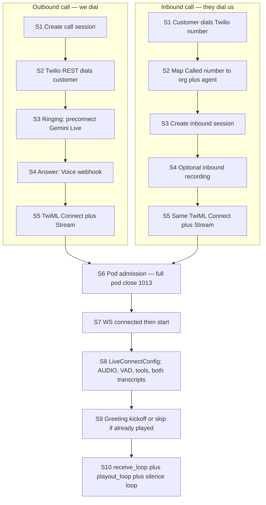
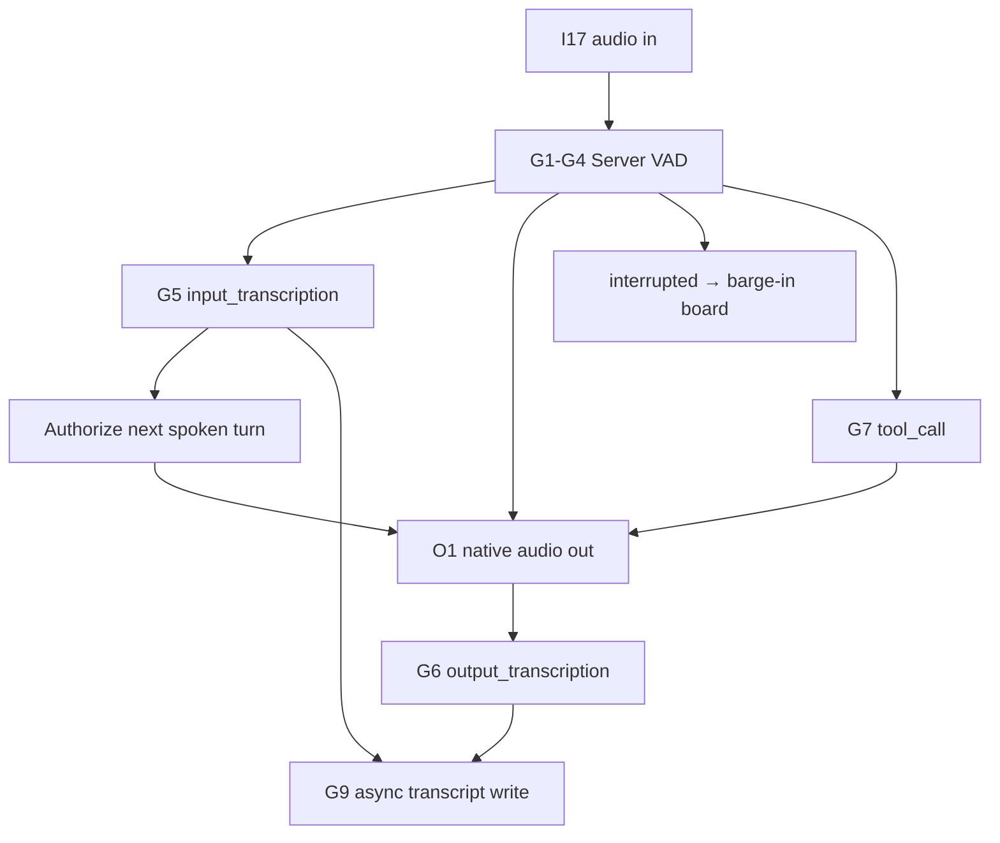

# Gemini Live Voice Agent — Ultimate Interview Guide (Complete Reference)

**Scope:** VoxGent backend **Google Gemini 2.5 native audio-to-audio** pipeline only  
(`voice_stack = gemini_live_native`). Not the classic Google STT/TTS pipeline, not ElevenLabs ConvAI.

**Companion doc:** For interview **talk tracks**, production tradeoffs, and “what we got wrong,” see [GEMINI_LIVE_VOICE_AGENT_INTERVIEW_GUIDE.md](./GEMINI_LIVE_VOICE_AGENT_INTERVIEW_GUIDE.md).

**Visual whiteboard:** [gemini-live-pipeline-whiteboard.md](./gemini-live-pipeline-whiteboard.md) (GitHub) · [Canvas in Cursor](/home/aalokmehra/.cursor/projects/home-aalokmehra-Desktop-lear/canvases/gemini-live-pipeline-whiteboard.canvas.tsx) (interactive)

**How to use this in an interview:** Lead with the end-to-end story in 60 seconds, then go deep on whatever they probe (Twilio, VAD, noise, barge-in, transcripts). Numbers and file names below are from this repo — use them. If you forget a threshold, say the *reason* the knob exists; that scores higher than memorizing every env var.

---

## 60-second pitch (memorize this)

We run a **bidirectional native-audio session** with Gemini Live. Twilio Media Streams sends **8 kHz µ-law** over a WebSocket. We decode to PCM, run **client-side DSP** (noise suppression, AGC, near/far gating) so Gemini’s **server VAD** sees a clean near-field caller, resample to **16 kHz PCM**, and stream into Gemini Live (`gemini-live-2.5-flash-native-audio` on Vertex). Gemini returns **24 kHz native speech audio** plus **input and output transcripts**. We resample back to 8 kHz µ-law, **pace frames in real time** to Twilio, and persist transcripts asynchronously so the audio path never blocks on the database.

The hard problems are not “calling the API.” They are **echo/TV barge-in**, **quiet handset speech**, **not manufacturing end-of-turn silence**, **keeping transcripts complete under loop lag**, and **not dropping audio under backpressure**.

---

## Whiteboard: complete pipeline

**Two meanings of inbound/outbound — say which one you mean.**

| Word | Meaning |
|---|---|
| **Call** inbound / outbound | Who started the phone call. Setup differs. After Stream `start`, audio is the same. |
| **Audio** inbound / outbound | Which way samples flow. IN = caller → Gemini. OUT = Gemini → caller. |

Memorize three lanes: **Audio IN** · **Gemini brain** · **Audio OUT**. Twilio events wrap them: `connected` → `start` → `media` → `stop`.

### Call setup (who dials)



| Step | Outbound | Inbound |
|---|---|---|
| Who starts | Our API / campaign | Customer |
| Session | Already in `active_call_sessions` | Created after number routing |
| Preconnect | Yes, on `ringing` | Usually no — Stream is immediate |
| `patient_phone` | Twilio To | Twilio From |
| Greeting | Native Gemini (skip Google TTS) | Same unless routing fallback Say+Hangup |
| After S5 | Identical Media Stream audio path | Identical Media Stream audio path |

### Audio IN — caller to Gemini (every hop)

```mermaid
flowchart LR
  A1[I1 Phone] --> A2[I2 Twilio media JSON]
  A2 --> A3[I3 Keep inbound track only]
  A3 --> A4[I4 Base64 decode]
  A4 --> A5[I5 ulaw2lin]
  A5 --> A6[I6 Buffer 5 frames / cap 10]
  A6 --> A7[I7 DSP off event loop]
  A7 --> A8[I8 RNNoise or Hush plus AGC]
  A8 --> A9[I9 Near-far / music / transients]
  A9 --> A10[I10 foreground_safe blend]
  A10 --> A11[I11 Quality class]
  A11 --> A12[I12 Client send gate]
  A12 --> A13[I13 Mute cap / zero-fill cap]
  A13 --> A14[I14 Silence-hold]
  A14 --> A15[I15 ratecv 8k to 16k]
  A15 --> A16[I16 Min interval 100 ms]
  A16 --> A17[I17 send_realtime_input]
```



| # | Step | Format | Why it exists |
|---|---|---|---|
| I1 | Caller speaks | phone | PSTN |
| I2 | `event=media` | JSON + base64 | Twilio Media Streams |
| I3 | Drop `outbound` track | — | Echo would barge-in on ourselves |
| I4 | Decode payload | µ-law 8 kHz | Wire format |
| I5 | `ulaw2lin` | PCM16 8 kHz | DSP needs linear PCM |
| I6 | Buffer 5 / cap 10 | PCM16 8 kHz | 100 ms batches; cap avoids Gemini **1011** |
| I7 | `process_inbound_pcm_for_gemini` | PCM16 8 kHz | Off asyncio loop |
| I8 | RNNoise/Hush + AGC | PCM16 8 kHz | Noise + quiet handsets (−16 dBFS) |
| I9 | Near/far, music-like, transients | metrics | TV / far talker / horns |
| I10 | `foreground_safe` blend | PCM16 8 kHz | ~10% raw so speech is not crushed |
| I11 | GOOD / LOW_VOLUME / NOISY | class | Tightens later gates |
| I12 | `_gate_inbound_audio` | pass / mute / buffer | **Not** turn-taking — send gate only |
| I13 | Mute/zero-fill cap 4 frames | leak attenuated | Must stay &lt; 1200 ms VAD silence |
| I14 | Silence-hold | — | Long answers ≠ hangup |
| I15 | `ratecv` | PCM16 **16 kHz** | Gemini inbound rate |
| I16 | Min send interval | — | Second 1011 defense |
| I17 | `send_realtime_input` | Live WS | Gemini **server VAD** now hears it |

### Audio OUT — Gemini to caller (every hop)


| # | Step | Format | Why it exists |
|---|---|---|---|
| O1 | `model_turn` audio parts | PCM16 **24 kHz** | Native audio, not TTS |
| O2 | TURN-GUARD | — | Drop unsolicited extra turns |
| O3 | Mute after `end_call` | — | No talking after goodbye |
| O4 | Bounded PCM queue | PCM16 24 kHz | **Delay, never drop** (except barge-in) |
| O5 | `playout_loop` | — | `_assistant_speaking` until playout estimate ends |
| O6 | `ratecv` | PCM16 8 kHz | Twilio rate |
| O7 | `lin2ulaw` | µ-law 8 kHz | Media Streams outbound |
| O8 | 20 ms = 160 B (or 100 ms batch) | µ-law frames | Same sound; fewer loop wakeups if batched |
| O9 | `{event:media, payload}` | JSON | Twilio protocol |
| O10 | `media_sender` task | WS send | Backpressure delays |
| O11 | Sleep `len/8000` | pacing | Rebase debt instead of bursting |
| O12 | Twilio → PSTN | phone | Caller hears agent |
| O13 | Barge-in only: purge + `clear` | — | **Only** correct drop |

### Gemini brain (same Live socket as IN and OUT)



| # | Step | Remember |
|---|---|---|
| G1 | Server AAD **on**; client activity **off** | We gate; Gemini turn-takes |
| G2 | Start HIGH, end LOW, prefix ~300 ms | Catch speech, keep first consonant |
| G3 | Silence 1200 ms (3500 slow) | End of caller turn |
| G4 | `START_OF_ACTIVITY_INTERRUPTS` | Barge-in at the API |
| G5 | Input transcript | Usability filter; persist even if rejected |
| G6 | Output transcript | Flush on `turn_complete` or interrupt |
| G7 | Tools | RAG / end_call / transfer; does not spend audio token |
| G8 | `go_away`, resumption handle, usage ledger | Charge from `gemini_live_usage` |
| G9 | `_spawn_turn_write` | Never block audio on Postgres |

### Barge-in board (when OUT is interrupted by IN)

Confirm → interrupt → clear → re-anchor.

1. Agent speaking → inbound muted by default  
2. Barge candidate? (not idle, not TV, not horn; greeting needs higher RMS)  
3. Debounce 3 frames (4 if noisy)  
4. Forward caller audio → Gemini emits `interrupted`  
5. First-message guard: may keep playing greeting  
6. Cancel playout, new queue, flush assistant as `interrupted`  
7. **Purge then `clear`** (clear behind the queue still plays the old sentence)  
8. Re-anchor unspoken tail (generation cursor ≠ playout cursor)  
9. False-interrupt recovery if it was noise  

### Format strip (draw this first in an interview)

```
IN:  phone → µ-law 8k → PCM 8k → DSP/gate → PCM 16k → Gemini
OUT: Gemini → PCM 24k → queue → PCM 8k → µ-law 8k paced → phone
```

Numbers: Twilio **8k** both ways · Gemini in **16k** · Gemini out **24k** · VAD silence **1200 ms** · zero-fill cap **400 ms** · barge **300 ms** · min send **100 ms**.

**Key files (code walkthrough ammo):**

| Layer | File |
|---|---|
| TwiML / stream URL | `app/api/v1/quick_call_webhook.py` |
| WS entry | `app/websocket/voice_router.py` → `/ws/voice` |
| Twilio event loop | `app/websocket/rt_voice_websocket.py` |
| Adapter (µ-law ↔ session) | `app/services/voice/gemini_live_twilio_adapter.py` |
| Live session (DSP, VAD, Gemini) | `app/services/voice/gemini_live_session.py` |
| Inbound DSP | `app/services/voice/inbound_audio_processor.py` |
| Noise backends | `gemini_live_rnnoise_filter.py`, `gemini_live_hush_filter.py`, `gemini_live_noise_filter.py` |
| Outbound codec / pacing | `app/services/voice/twilio_audio_codec.py` |
| Model / RAG / gating | `app/services/voice/gemini_live_bridge.py` |
| Ringing preconnect | `app/services/voice/gemini_preconnect.py` |
| Transcript usability | `inbound_audio_processor.assess_transcript_usability` |
| Post-call script fix | `app/services/voice/transcript_script_normalizer.py` |

---

## End-to-end flow (interview walkthrough)

Walk this in order. Interviewers usually stop you at the layer they care about.

### 1. Call setup (before audio)

1. Twilio hits our Voice webhook (`quick_call_webhook`).
2. We return TwiML: `<Connect><Stream url="wss://…/ws/voice">` plus custom parameters (`agentId`, `organizationId`, `language`, `call_sid`, `patient_phone`, `call_direction`, optional `greeting` / `greeting_played`).
3. For Gemini Live we **do not** pre-play Google TTS greeting (native greeting is spoken by Gemini). Exception: a cached greeting URL can play first; then we tell Gemini *not* to repeat it.
4. **Preconnect:** while the phone is still ringing, `preconnect_gemini_live(call_sid, …)` opens the Gemini Live WebSocket so answer latency is not a cold connect. Transcripts produced during ring are buffered (`PreconnectTranscriptBuffer`) and replayed when the adapter binds.
5. Pod admission: `voice_stream_admission.try_acquire` — if the pod is full we **accept then close 1013** (“try again later”) so Twilio/LB can retry another pod. Closing *before* accept becomes HTTP 403, which is the wrong signal.

### 2. Twilio Media Streams WebSocket

Protocol is Twilio’s JSON Media Streams (not Socket.IO).

| Event | What we do |
|---|---|
| `connected` | Store `streamSid` |
| `start` | Load agent, create conversation, start `GeminiLiveTwilioAdapter` |
| `media` | Base64-decode payload, **drop outbound track**, `adapter.add_audio_chunk(mulaw, True)` |
| `stop` | `pipeline.stop("twilio_stop_event")`, close WS so TwiML can Redirect (transfer/fallback) |

**Track filter:** `should_forward_twilio_track` only forwards `inbound` / `inbound_track`. Outbound (agent audio echoed back by Twilio) must never re-enter Gemini or we get **echo barge-in** and the agent interrupts itself.

Outbound path is a dedicated `media_sender` task draining a bounded queue. Congestion **delays, does not drop**, except barge-in which *must* drop queued agent audio then send Twilio `clear`.

### 3. Audio formats (draw this on a whiteboard)

| Hop | Format | Rate | Why |
|---|---|---|---|
| Twilio inbound | µ-law | 8 kHz | PSTN / Media Streams contract |
| After `audioop.ulaw2lin` | PCM16 mono | 8 kHz | DSP (RNNoise/Hush) runs at 8 kHz |
| Into Gemini | PCM16 | **16 kHz** | `GEMINI_LIVE_INBOUND_RATE` |
| From Gemini | PCM16 native audio | **24 kHz** | `GEMINI_LIVE_OUTBOUND_RATE` |
| Back to Twilio | µ-law | 8 kHz | paced frames (20 ms = 160 bytes, or 100 ms if batching on) |

Resample both ways with `audioop.ratecv` and a **persistent state** so you do not click at chunk boundaries.

### 4. Inbound path inside `GeminiLiveSession.send_audio`

Per ~20 ms Twilio chunk (~160 bytes µ-law):

1. **Buffer 5 chunks (~100 ms)** before flushing. Caps at 10; drop oldest if the event loop lagged. Bursting triggers Gemini **error 1011** (“sending data too fast”).
2. Off the event loop (`run_dsp` / dedicated executor): `process_inbound_pcm_for_gemini`:
   - Noise filter (RNNoise default, or Hush, or classic Wiener)
   - AGC for quiet callers
   - Near/far classifier
   - Music/TV-bed detector
   - Audio mode (usually `foreground_safe`: blend ~10% raw + 90% denoised on speech so we do not over-suppress)
3. **Client gate** `_gate_inbound_audio`: decide send / mute / buffer-for-barge-in.
4. **Mute cap + zero-fill cap:** never send so much digital silence that Gemini’s server VAD thinks the caller stopped. After `GEMINI_LIVE_MAX_ZERO_FILL_FRAMES` (default 4 = 400 ms, under 1200 ms VAD silence), leak attenuated real audio.
5. Rate-limit sends (`GEMINI_LIVE_REALTIME_INPUT_MIN_INTERVAL_SEC` ≈ 100 ms).
6. `session.send_realtime_input(audio=Blob(pcm_16k, mime_type="audio/pcm;rate=16000"))`.

### 5. Two VADs (this is a favorite interview question)

**Gemini server VAD** is the turn-taker. Configured in `LiveConnectConfig.realtime_input_config.automatic_activity_detection`:

- `disabled=False` — we do **not** use client activity control (`GEMINI_LIVE_CLIENT_ACTIVITY_CONTROL=False`). Native streaming needs Gemini to own start/end of speech.
- Start sensitivity **HIGH**, end sensitivity **LOW** (catch speech quickly, do not cut off slow speakers).
- `prefix_padding_ms` ≈ 300 — keep the start of the word.
- `silence_duration_ms` ≈ **1200** (or **3500** in `slow_speech_mode`).
- `activity_handling = START_OF_ACTIVITY_INTERRUPTS` — barge-in at the API.

**Client-side “VAD” is not a second turn-taker.** It is a **send gate** so TV, far-field talkers, horns, and µ-law idle (~RMS 8) never reach Gemini. If we zero-fill too long, *we forge an end-of-turn* and the model talks over the caller. That is why mute/zero-fill are capped.

Activity for silence timers prefers **pre-filter RMS** so a quiet caller is not “dead air” after denoising.

### 6. Noise suppression

Platform default **on**. Agent `noise_suppression_enabled=false` cannot turn it off unless `GEMINI_LIVE_NOISE_ALLOW_AGENT_DISABLE` (needed so quality categories stay Good).

**Backends** (`GEMINI_LIVE_NOISE_BACKEND`):

| Backend | What it is | When |
|---|---|---|
| `rnnoise` (default) | RNNoise + AGC + SNR quality detector | Production default; near/far + music-like gates sit on this path |
| `hush` | DeepFilterNet-SE (`weya_nc`) @ 8 kHz, 10 ms hop | Stronger denoise; extra scene gates are **RNNoise-only** (`_hush_dsp_only`) |
| `classic_wiener` | Spectral Wiener | Fallback |

Fail-open: if the native lib fails, send raw PCM rather than killing the call (`GEMINI_LIVE_NOISE_FAIL_OPEN`).

**What DSP is defending against:**

- Ambient noise / fans
- TV / music beds (`MusicLikeGate`)
- Far-field / speaker in the room (near-field confidence ~0.42 / hard reject ~0.22)
- Transients (horns, slams) — attenuate, do not treat as barge-in
- Quiet handset / whisper — AGC + `soft_speech` so we do not gate them out
- Over-suppression — `GEMINI_LIVE_MAX_SPEECH_ATTENUATION_DB` (~8 dB) + raw-speech guard

Audio quality classes (`GOOD` / `LOW_VOLUME` / `NOISY_BACKGROUND`) tighten barge-in debounce and noise gates, and can trigger a **spoken warning** (“trouble hearing you”) with cooldown and max-once-per-call.

Optional **AEC gate** (`GEMINI_LIVE_AEC_ENABLED`) — SimpleAecGate; off by default because Twilio inbound-only already removes most acoustic echo of *our* playback.

### 7. Gemini Live API session

`client.aio.live.connect(model, config)` with:

- `response_modalities=["AUDIO"]` — native audio out, not text-then-TTS
- Voice via `speech_config.voice_config` (Kore, Puck, …)
- `language_code` is set **but native audio largely ignores it**; accent is locked in **system instruction** (`build_gemini_live_speech_instruction`)
- `input_audio_transcription` + `output_audio_transcription` — both directions
- Tools: `query_knowledge_base`, `end_call`, transfer/handoff, Canvas EMR, etc.
- `session_resumption` (transparent handle) + `context_window_compression` (sliding window) so long calls do not die when context fills
- Vertex-first (`GEMINI_USE_VERTEX=true`) → model `gemini-live-2.5-flash-native-audio`; AI Studio fallback uses a dated preview id

Greeting: send a **text kickoff** user turn (`send_client_content`, `turn_complete=True`) so Gemini speaks the exact opening line from SI. That is cheaper/cleaner than hoping the model improvises.

Receive loop handles: `server_content` (audio parts, transcripts, `interrupted`, `turn_complete`), `tool_call`, `session_resumption_update`, `go_away`, `usage_metadata`.

### 8. Outbound / playout

1. Audio parts → bounded `_outbound_queue` (lossless wait if full — **never drop the start of a sentence**).
2. `_playout_loop` → `send_audio_paced`: 24 kHz → 8 kHz → µ-law → Twilio `media` JSON.
3. Pacer sleeps per frame duration. If the loop is behind, yield and **rebase debt** (`GEMINI_LIVE_MAX_PACING_DEBT_MS`) instead of bursting.
4. `_assistant_speaking` stays true until estimated Twilio playout finishes, not when the local queue empties (otherwise barge-in gates open too early).

### 9. Barge-in (interruption)

**Confirm, then interrupt.** Consecutive speech frames (3 = 300 ms, or 4 in `NOISY_BACKGROUND`). Greeting uses a higher RMS floor so connection artefacts (“k s t”) do not cut the hello.

On Gemini `interrupted`:

1. If first message is non-interruptible: **do not clear Twilio**; keep playing greeting; still capture caller transcript.
2. Else: cancel playout, new outbound queue, flush assistant text as `interrupted=True`, send Twilio **`clear` after purging queued frames** (`send_clear_now`), re-anchor context to what the caller *actually heard* vs what Gemini generated (playout cursor ≠ generation cursor).
3. False-interrupt recovery: if it was noise, resume after a quiet window.

**Interrupt re-anchor:** Gemini truncates history at its generation cursor; we may have discarded seconds of unplayed audio. We inject a note of the unspoken tail so the model does not think it already asked the next question.

### 10. Transcripts (interview-critical)

Gemini streams:

- `input_transcription` — caller (ASR on what we forwarded)
- `output_transcription` — agent (what it is saying)

**We do not run a separate STT.** Transcripts are a Live API feature. That means **gating audio also gates ASR**: if we mute the caller, there is no transcript.

**Usability filter** (`assess_transcript_usability`) — structural only:

- Reject empty, `{Unintelligible}` / `{}` / `[SYSTEM …]`
- Allow numeric replies (OTP, dates)
- **Do not drop** on script mismatch (Hinglish/Devanagari on an `en-US` agent is valid)

Rejected turns are **still persisted** with `metadata.asr_rejected` + reason so the UI does not show a silent gap. They generally **do not authorize** a model turn (avoids stuck-recovery storms on junk ASR).

Accepted turns:

- Authorize the next model audio (`_authorize_model_response('user_transcript')`) — **one audio turn per caller authorization** so noise-triggered extra replies are dropped
- Fire-and-forget DB write (`_spawn_turn_write`) so the receive loop never blocks on Postgres
- Timeout + retry with shared `write_id` (idempotent); timeouts are event-loop stalls, not slow SQL (~2 ms path)
- Script mismatch is an **annotation**, not a drop
- Redis session turn append for live UI
- Dialog-state slot fill + optional memory nudge into Gemini (not spoken)

Interrupted agent speech is saved with `interrupted: true` — caller heard it; Gemini did not finish.

**Post-call:** `transcript_script_normalizer` re-spells wrong alphabet (e.g. English words written in Devanagari) **without translating**. One LLM batch after hangup; zero live latency.

**Internal transcripts:** silence prompts / noise warnings are injected as system text; Gemini sometimes echoes them into `input_transcription`. We match and ignore those so they do not look like the caller spoke.

Preconnect greeting transcripts are buffered and drained onto the real callbacks so the conversation does not start at the caller’s first turn.

### 11. Tools, RAG, call control

Function calling on the same Live session (not a second LLM hop for the voice itself):

- `query_knowledge_base` — org RAG; speculative prefetch; skip if KB confirmed empty
- `end_call` — requires clear hangup / confirmation; playback timeout then Twilio hangup
- `transfer_to_number` / Teams / `transfer_to_agent` (same Media Stream, swap Gemini session — not a conference until human transfer)
- Canvas EMR, TMS, outreach when flagged

Tool calls do **not** consume the one-turn audio authorization; the spoken answer after the tool result still plays.

### 12. Call-level reliability

| Mechanism | Why |
|---|---|
| Silence ladder `9s, 16s, 23s, 32s` | “Are you still there?” then `end_call` |
| Speech-hold | Long answers must not trigger silence prompts mid-utterance |
| Stuck recovery | Model authorized but no audio — inject a nudge (capped) |
| Noise-stall recovery | Continuous TV holds Gemini VAD open — inject “please repeat” |
| `go_away` | Log time_left; session will die |
| Session resumption handle | Stored for future reconnect-on-drop |
| AMD / voicemail | Skip spoken noise/silence prompts in voicemail mode |
| Usage ledger | `gemini_live_usage` log + conversation metadata + Redis — **source of truth for charging** (Live WS labels are unreliable in Cloud Billing) |

---

## Extra interview topics (beyond the happy path)

These separate “I read the Google docs” from “I shipped this.”

**Latency budget.** Preconnect during ring, RAG preload (generic org facts) + keep the tool for specific questions, greeting in SI + kickoff text (not a second model), DSP off the event loop, 100 ms inbound batching, 100 ms outbound frames to cut loop wakeups. First audible frame is marked `call_phase_timing` (`gemini_connect`, `greeting_sent`, `first_frame`).

**Why native audio, not STT → LLM → TTS.** One model owns turn-taking, barge-in, and voice. Lower TTFB, more natural overlap. Cost: less control over exact wording, transcripts can lag or hallucinate placeholders, language_code is weak so we lock accent in the prompt.

**Event loop is the bottleneck.** RNNoise/Hush must not run on the asyncio loop. Twilio send must yield. Transcript writes are tasks. 1011 is almost always “we bursted after a stall.”

**Prompt layering (order matters).** Persona/accent → OUTPUT RULES (never read instructions aloud) → global behavior → agent prompt → noisy-env rules → end_call → grounding (last, so operators cannot weaken it) → conversation policies → CALL OPENING exact greeting. Then `_cap_system_instruction` for context budget.

**Ownership / speaker verify.** Feature-flagged (often observe-only). Enroll near-field speech; reject far-field from becoming the voiceprint.

**Hybrid fallback.** `GEMINI_LIVE_FLOW_MODE=hybrid` can fall back to classic STT/TTS if Live is not ready (e.g. RNNoise missing). Know that the *interview scope* is Live, but production has a safety net.

**Multi-tenant.** Org DB from Vault, conversation in org DB, Vertex labels `organization_id` / `agent_id` / `feature=gemini_live`. Do not put `call_sid` in GCP labels (cardinality).

---

## 30 interview Q&A (answer like you built it)

Use the **short answer** first, then **one level deeper** if they nod.

### Q1. Walk me through what happens when a caller says “hello.”

**Answer:** Twilio sends a `media` event with base64 µ-law. We keep inbound track only, decode to 8 kHz PCM, buffer ~100 ms, run RNNoise/AGC/near-far, gate as near-field speech, resample to 16 kHz, `send_realtime_input`. Gemini server VAD starts a user turn. After ~1.2 s of silence it ends the turn, emits `input_transcription` (“hello”), we persist it and authorize a model turn. Native 24 kHz audio arrives on `model_turn.parts`, we pace µ-law back to Twilio, and `output_transcription` is saved as the assistant message.

### Q2. Why not send Twilio audio straight to Gemini?

**Answer:** Twilio is 8 kHz µ-law; Gemini Live inbound wants 16 kHz PCM. More important: PSTN audio is full of TV, echo, and far-field speech. Gemini’s VAD will treat that as the caller and barge-in or hallucinate. Client DSP + gating is how we make native audio usable on real phone calls.

### Q3. Where does VAD actually run?

**Answer:** **Gemini’s automatic activity detection** decides turn boundaries and interruptions. Our code is a **pre-VAD send gate** (speech probability, RMS, near-field, transients). We explicitly leave `automatic_activity_detection.disabled=False` and `CLIENT_ACTIVITY_CONTROL=False` because native streaming needs the server to own activity.

### Q4. What happens if your gate zeros audio for too long?

**Answer:** Gemini sees `silence_duration_ms` (1200 ms) of silence and **ends the caller turn**, then talks over them. We cap consecutive mute/zero-fill at 4 frames (~400 ms) and then forward attenuated real audio so we never manufacture end-of-turn. Transcript-layer filters still catch leakage.

### Q5. How does barge-in work end to end?

**Answer:** While `_assistant_speaking`, inbound frames must look like a barge candidate (voiced, not transient, near-field, RMS above greeting floor). We buffer until N consecutive frames, then start forwarding. Gemini emits `interrupted`. We cancel playout, purge the outbound queue, send Twilio `clear` (so queued speech never plays), flush the assistant transcript as interrupted, and re-anchor unspoken content.

### Q6. Why purge the queue before `clear`?

**Answer:** `clear` appended *behind* queued frames means Twilio keeps playing the old sentence until the queue drains. With 100 ms frames that is a long, wrong tail. `send_clear_now` drops queued agent audio, then enqueues `clear`. That is the one case dropping audio is correct.

### Q7. How do you stop the agent from interrupting itself (echo)?

**Answer:** Only forward Twilio `inbound` track. Optional AEC. During agent speech, unconfirmed energy is muted. Greeting barge threshold is higher. Near/far + music-like gates kill TV. First message can be non-interruptible client-side while still capturing the caller’s words.

### Q8. RNNoise vs Hush vs Wiener — which and why?

**Answer:** Default **RNNoise**: good telephony speech/noise split, metrics for near/far and quality class. **Hush** (DeepFilterNet) is stronger suppression; we then skip RNNoise-only scene gates so we do not double-gate. **Wiener** is the classic fallback. Fail-open to raw if the native lib missing. Product default cannot be turned off per agent unless explicitly allowed.

### Q9. What is `foreground_safe` audio mode?

**Answer:** On detected speech we blend ~10% raw + 90% denoised so consonants survive. Background frames stay fully filtered. If attenuation exceeds ~8 dB on a near-field voiced frame, a raw-speech guard can pass original PCM so we do not crush the caller.

### Q10. Why 16 kHz in and 24 kHz out?

**Answer:** Those are Gemini Live native-audio rates in this stack (`GEMINI_LIVE_INBOUND_RATE=16000`, `OUTBOUND_RATE=24000`). Twilio is always 8 kHz. We resample at the edges and keep ratecv state.

### Q11. Why buffer 5 inbound chunks? Why cap at 10?

**Answer:** 5 × 20 ms ≈ 100 ms reduces WebSocket packet rate. If the event loop stalls, the buffer can explode; flushing it all at once is Gemini 1011. Cap 10 and keep the newest 5 — stale audio under lag is worse than a small gap.

### Q12. How are transcripts produced? Do you have a separate STT?

**Answer:** No separate STT. `input_audio_transcription` and `output_audio_transcription` on `LiveConnectConfig`. Fragments stream on `server_content`; we concatenate output until `turn_complete` (or interrupt). Quality of ASR is coupled to what we send — garbage in, `{Unintelligible}` out.

### Q13. A transcript is wrong-script (English in Devanagari). Do you drop it?

**Answer:** **No.** `detect_script_mismatch` is observation-only. Dropping it deleted real Hinglish/Marathi. We annotate `script_warning` on the live turn. After the call, `transcript_script_normalizer` re-spells alphabet without translating, with word-count bounds so the LLM cannot rewrite meaning.

### Q14. What if ASR returns `{Unintelligible}`?

**Answer:** `assess_transcript_usability` rejects `placeholder_or_internal_text`. We still **save** it as `asr_rejected` so the transcript is honest. We **do not** authorize a model turn or arm the stuck watchdog (that caused recovery storms). We may arm a short window so if Gemini still speaks, we do not TURN-GUARD it into silence.

### Q15. How do you persist transcripts without hurting audio?

**Answer:** `create_background_task` / `_spawn_turn_write` from the receive loop. Writes use `asyncio.wait_for` + retries and a `write_id` so a timed-out-but-committed insert is not duplicated. Strong refs on in-flight tasks because asyncio only holds weak refs. Failures log `[TRANSCRIPT-LOST]` + DB pool stats (including **vault** pool — org writes stall if vault is exhausted even when org pools look idle).

### Q16. Interrupted agent text — keep or drop?

**Answer:** **Keep, flag `interrupted`.** The caller already heard that audio. Dropping it makes the transcript disagree with the call recording. Downstream analysis must not treat it as a finished question.

### Q17. How do you start the Gemini session fast enough for “hello”?

**Answer:** `preconnect_gemini_live` during ringing, keyed by `call_sid`. Adapter **adopts** the session if voice + locale match (those are fixed on the setup frame — wrong voice cannot be rebound). If media already started, late preconnect discards itself (`_media_active_sids`). Cold path: connect on Twilio `start`. Greeting transcripts during ring are buffered so they are not lost.

### Q18. Native audio ignores `language_code`. So how do you get an Indian English accent?

**Answer:** We still send `language_code`, but the real lock is **system instruction first** (`PERSONA AND SPEECH` / `build_gemini_live_speech_instruction`). OUTPUT RULES say a generic “speak English” in the agent prompt must not override the accent. Locale resolution must match preconnect vs websocket path — we do **not** use the ElevenLabs mapper that collapsed `en-IN` → `en-US`.

### Q19. How does the knowledge base work on a live call?

**Answer:** Optional preload of generic RAG into the system prompt (hours, policies) if under `GEMINI_LIVE_KB_PRELOAD_MAX_CHARS`. Tool `query_knowledge_base` remains for specific questions. Speculative RAG on partial transcripts. If the collection is empty we set `_kb_confirmed_empty` so we do not embed every turn (~1 s) and trip stuck-recovery.

### Q20. How does `end_call` not hang up too early?

**Answer:** Tool description + prompt require explicit hangup or “I’m done” after goodbye. `GEMINI_LIVE_END_CALL_REQUIRE_USER_CONFIRM`, cooldown, and a disconnect classifier that ignores replies to *our* “your voice is too soft” warnings. We wait for goodbye audio to play (`DISCONNECT_PLAYBACK_TIMEOUT`) then Twilio hangup. Silence ladder can synthesize an `end_call` tool call after the last timeout.

### Q21. What is turn authorization / TURN-GUARD?

**Answer:** Native audio can emit extra turns after noise or a finished reply. We require an authorization reason (`user_transcript`, `initial_greeting`, silence prompt, etc.). Unauthorized audio is not played. Thought/text-only `model_turn` events do not consume the token — only audible parts do. New caller transcript rebinds a rejected pending turn.

### Q22. How do you handle long calls and context limits?

**Answer:** Cap system instruction size. Sliding-window `context_window_compression`. Session resumption handles. Dialog-state injects slot memory instead of relying on the model to remember every field. We still log `go_away`.

### Q23. The agent asked two questions and then answered itself. How do you prevent that?

**Answer:** SI: one question per turn, strict turn-taking, stop after asking. Dialog state tracks `pending_slot`. After barge-in, DIALOG-RESUME / interrupt re-anchor restores the pending question. This is prompt + state, not a hard decoder constraint — be honest that native audio can still drift; we mitigate, we do not formally constrain tokens.

### Q24. Backpressure: what do you drop vs delay?

**Answer:** **Delay** inbound-to-Twilio agent audio (bounded queue, playout waits). **Drop oldest inbound** only when the 8 kHz buffer exceeds 10 under loop lag. **Drop queued outbound** only on barge-in. Never drop the head of a sentence to “keep latency” — that sounds like the agent glitched.

### Q25. How do you bill Gemini Live per customer?

**Answer:** Vertex-first with labels (`feature=gemini_live`, org, agent). Live WebSocket labels are **unreliable** in Cloud Billing. Source of truth is the **app ledger**: `usage_metadata` merged in the receive loop, persisted as `gemini_live_usage` (duration + tokens) on the conversation, Redis backup, structured log. Invoice from that, not from Billing reports alone.

### Q26. What is error 1011 and how did you fix it?

**Answer:** Gemini Live rejects input sent too fast. Causes: flushing a huge inbound buffer after event-loop lag, no min send interval, DSP on the loop blocking then bursting. Fixes: buffer cap 10, min interval ~100 ms, DSP in a thread/executor, pacing debt rebase on outbound so we do not spin-dump frames.

### Q27. How is this different from a classic STT → LLM → TTS voice bot?

**Answer:** Classic: Google STT finals → orchestrator LLM → TTS chunks. We still have that stack (`VoicePipelineService`) as fallback. Live: one bidirectional audio model, server VAD, native voice, built-in ASR transcripts, tools on the same socket. Tradeoff: richer barge-in and lower latency vs weaker lexical control and more DSP responsibility on our side.

### Q28. Walk through a noisy TV in the background.

**Answer:** RNNoise marks low speech probability / high flatness; quality may latch `NOISY_BACKGROUND`. Near/far confidence stays low → send gate zeros far-field. Music-like gate can latch. Barge debounce adds a frame. If TV still holds VAD open with no accepted transcript, noise-stall recovery injects “please repeat” (rate-limited). Spoken noise warning at most once. Squelch exists but is off by default. Transcript placeholders are rejected without authorizing replies.

### Q29. How do AI-to-AI agent handoffs work without dropping Twilio?

**Answer:** Same Media Stream. `transfer_to_agent` validates org + max hops, mutes session A, returns the function response, then a background task starts session B with a new `GeminiLiveSession` (new prompt/voice). Comfort tone optional during the gap. Human transfer is different: conference / `<Dial>` after stream stop + Redirect.

### Q30. If you had to debug “agent talked over the caller,” where do you look first?

**Answer:** In order: (1) Did we zero-fill past VAD silence? Check `[GATE-MUTE-CAP]` / zero-fill streak. (2) Did TV pass the send gate? `audio_route`, `near_field_confidence`, `foreground_speech`. (3) Was barge-in confirmed on noise? greeting RMS, transients. (4) Did `_assistant_speaking` clear before Twilio finished playout? (5) Unauthorized extra model turn — TURN-GUARD logs. (6) Transcript of what Gemini thought it heard (`input_transcription` vs rejected). Correlate `session=` / `call_sid` / `[LATENCY]` / `[AUDIO-UTTERANCE]`.

---

## Bonus Qs (if they keep going)

**Q31. Why is DSP off the event loop?**  
~10 ms/chunk at 8 kHz × N calls starves Twilio send and Gemini receive. `run_dsp` uses a dedicated executor when enabled.

**Q32. What does `START_OF_ACTIVITY_INTERRUPTS` mean vs muting on our side?**  
API-level: Gemini stops generating when it detects user speech in the **audio we send**. If we mute, Gemini cannot interrupt even if the caller is talking — that is why we forward during non-interruptible greeting (capture speech) but ignore the interrupted event.

**Q33. How do you keep µ-law idle from looking like speech?**  
Idle RMS ~8. Barge candidates require RMS ≥ 20. Soft-speech floor ~25. Do not treat idle as activity.

**Q34. Session resumption vs just reconnecting?**  
We store a transparent resumption handle from `session_resumption_update`. Full reconnect-on-drop using that handle is prepared in config; today `go_away` / transport loss mainly ends the session and we notify connection lost. Do not claim seamless mid-call resume unless you have seen it shipped.

**Q35. How do you test this without placing calls?**  
`process_inbound_pcm_for_gemini` and usability helpers are extracted without session deps. `GEMINI_LIVE_DUMP_INBOUND_WAV` dumps pre-gate 8 kHz and sent 16 kHz. Soak tests named by call ids in comments (e.g. false barge on greeting artefacts). Unit tests around hush / transcript usability.

---

## Whiteboard numbers cheat sheet

| Thing | Typical value | Meaning |
|---|---|---|
| Twilio frame | 20 ms, 160 bytes µ-law | Protocol |
| Inbound flush | 5 frames / 100 ms | Packet aggregation |
| Gemini in / out | 16 kHz / 24 kHz PCM16 | Native audio |
| Server VAD silence | 1200 ms (3500 slow) | End of caller turn |
| Max zero-fill | 4 frames / 400 ms | Must stay < VAD silence |
| Barge debounce | 3 frames (4 if noisy) | Confirm interrupt |
| Greeting barge RMS | ~80–200 | Ignore connect pops |
| Near-field threshold | ~0.42 | Far-field mute |
| AGC target | −16 dBFS | Quiet handsets |
| Min send interval | 100 ms | Avoid 1011 |
| Silence disconnect | 9 / 16 / 23 / 32 s | Ladder |
| Stream close when full | 1013 | Retry another pod |

---

## How to structure a 45-minute interview

1. **5 min — pitch + diagram** (Twilio WS → DSP → Gemini Live → paced µ-law; dual VAD).
2. **10 min — audio path** (formats, RNNoise, gate mute cap, 1011).
3. **10 min — barge-in + clear** (debounce, first-message guard, queue purge, re-anchor).
4. **10 min — transcripts** (no separate STT, usability vs persist, interrupted flag, post-call script fix, non-blocking writes).
5. **10 min — production** (preconnect, Vertex + usage ledger, silence/stuck, hybrid fallback, what you’d improve).

If they only want architecture, stay at layers. If they want depth, pick **mute-cap** or **transcript authorization** — both are unique to this codebase and show you understand failure modes, not just the Google sample.

---

## What not to say

- “We use Gemini as TTS after an LLM.” This pipeline is **native audio-to-audio**.
- “We implemented VAD instead of Google’s.” We **gate**; Google **turn-takes**.
- “We drop audio under load to keep latency.” We delay; we drop only barge-in and stale inbound overflow.
- “Wrong-script transcripts are discarded.” They are annotated and fixed post-call.
- “language_code sets the accent.” It is insufficient; SI locks it.
- “Cloud Billing labels are how we invoice Live.” Ledger is source of truth.

---

## Suggested closer (if they ask “what would you improve?”)

Pick one honest gap: (1) use the resumption handle to actually reconnect on `go_away` without dropping the PSTN leg; (2) tighter coupling of playout cursor vs Gemini generation for re-anchor; (3) make TURN-GUARD and DSP thresholds less of a flag jungle by promoting a single audio-policy object per call quality class. That shows ownership without trashing the system.
