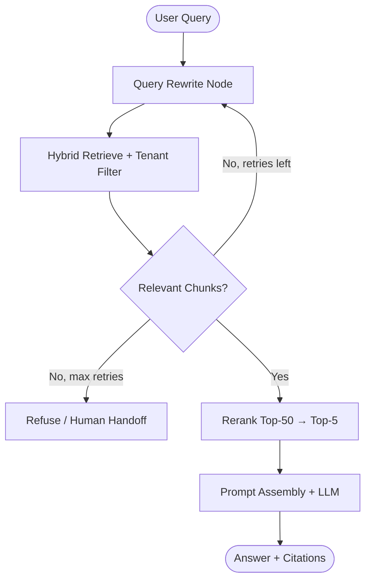

# Lesson 5: Production RAG Pipeline (Siemens Interview Mode)

This document provides a detailed breakdown of building a **production-grade Retrieval-Augmented Generation (RAG)** pipeline. We analyze async document ingestion, chunking strategies, hybrid retrieval, reranking, prompt assembly with citations, multi-tenant isolation, evaluation loops, and the failure modes that break RAG systems in enterprise deployments.

---

## 1. Conceptual Breakdown of Concepts

For every fundamental concept below, we address **Why**, **What**, **Where**, **How**, **Production Considerations**, **Interview Explanation**, and **Common Mistakes**.

### A. Async Ingestion Pipeline
*   **Why**: Uploading a 500-page PDF synchronously inside an HTTP request blocks the API thread for minutes, causes gateway timeouts, and prevents concurrent user traffic.
*   **What**: A decoupled, event-driven pipeline where document upload triggers a background job that parses, chunks, embeds, and indexes content without blocking the client.
*   **Where**: Operates between the upload API (FastAPI) and the vector database, typically orchestrated via a task queue (Celery, Cloud Tasks, Pub/Sub).
*   **How**: Client uploads file → API stores raw blob in GCS/S3 → publishes `ingest_job` message → worker pulls job → runs parse/chunk/embed/upsert → updates job status in PostgreSQL.
*   **Production Considerations**: Implement idempotent job IDs (`doc_id#version`), dead-letter queues for failed jobs, and a status API (`pending` → `processing` → `indexed` → `failed`). Never assume ingest completes in the same HTTP response.
*   **Interview Explanation (30 seconds)**: *"Production RAG ingestion is always async. The upload endpoint accepts the file, enqueues a background job, and returns immediately with a job ID. A worker handles parsing, chunking, embedding, and vector upsert. This prevents HTTP timeouts, enables retries on transient embedding API failures, and scales horizontally by adding more workers."*
*   **Common Mistakes**: Running full PDF parsing and embedding inside the request handler, or failing to track ingest status so clients query an empty index before vectors are searchable.

### B. Chunking (Size, Overlap, Parent-Child)
*   **Why**: LLMs have finite context windows. Entire documents cannot be embedded or injected into prompts. Chunking determines retrieval precision — too large and irrelevant text dilutes the match; too small and semantic meaning is lost.
*   **What**:
    *   **Chunk Size**: Number of tokens per chunk (typically 256–512 for voice, 512–1024 for chat).
    *   **Overlap**: Shared tokens between adjacent chunks (typically 10–20%) to prevent sentences from being split across boundaries.
    *   **Parent-Child**: Small child chunks are embedded for precise retrieval; larger parent chunks are returned to the LLM for surrounding context.
*   **Where**: Applied in the ingestion worker after document parsing and before embedding.
*   **How**: Use a recursive text splitter (by paragraph → sentence → token) with `chunk_size=512`, `chunk_overlap=64`. Store parent chunk ID in child metadata for context expansion after retrieval.
*   **Production Considerations**: Chunk by document structure (headings, tables) when possible — naive fixed-token splits break tables and numbered policy sections. For compliance docs, preserve section IDs in metadata.
*   **Interview Explanation (30 seconds)**: *"Chunking is the highest-leverage RAG decision. We use 400–512 token chunks with 15% overlap for enterprise KBs. Parent-child indexing embeds small chunks for precise retrieval but returns the parent paragraph to the LLM so answers have full context. Wrong chunking causes more quality loss than any prompt tweak."*
*   **Common Mistakes**: Using one global chunk size for PDFs, HTML, and CSV; or retrieving child chunks without expanding to parent context, producing fragmented answers.

### C. Metadata Schema
*   **Why**: Vector similarity alone cannot filter by tenant, document type, effective date, or access level. Metadata enables scoped retrieval and citation traceability.
*   **What**: Structured key-value fields attached to each chunk: `tenant_id`, `doc_id`, `chunk_index`, `source_url`, `page_number`, `section_title`, `effective_date`, `doc_version`.
*   **Where**: Stored alongside vectors in Pinecone/pgvector and returned with every retrieval result.
*   **How**: Define a Pydantic `ChunkMetadata` model at ingest time. Validate and serialize before upsert. Pass metadata filters on every query.
*   **Production Considerations**: Index filterable metadata fields in the vector DB. Keep payload size reasonable — store large text in object storage, not in vector metadata.
*   **Interview Explanation (30 seconds)**: *"Every chunk carries metadata: tenant ID, document ID, page, section, and version. Metadata powers tenant isolation filters, citation links back to source documents, and time-based retrieval — for example, only policies effective after a given date."*
*   **Common Mistakes**: Storing only the chunk text with no source pointer, making citations impossible; or putting unindexed metadata fields that cannot be filtered at query time.

### D. Embedding Batching
*   **Why**: Calling the embedding API once per chunk creates massive network overhead and hits rate limits during bulk ingest.
*   **What**: Bundling multiple text chunks into a single API request (e.g., 100–256 strings per call).
*   **Where**: In the ingestion worker between chunking and vector upsert.
*   **How**: Accumulate chunks into batches, call `embeddings.create(input=[...])`, map returned vectors back to chunk IDs by index position.
*   **Production Considerations**: Implement retry with exponential backoff on HTTP 429. Track embedding model version in metadata — model changes require full re-embed. Batch size must respect API payload limits (~8MB).
*   **Interview Explanation (30 seconds)**: *"Embedding APIs are GPU-bound and support batch input. Sending 200 chunks per request instead of 200 sequential calls cuts ingest time by an order of magnitude. We batch at the worker level with retry logic and map vectors back to chunk IDs by array index."*
*   **Common Mistakes**: Sequential single-chunk embedding in a loop; or mixing embedding models across old and new vectors in the same index.

### E. Pinecone vs pgvector
*   **Why**: Vector storage must support ANN search, metadata filtering, and operational scale appropriate to your team and traffic profile.
*   **What**:
    *   **Pinecone**: Managed vector database with HNSW indexes, namespaces, serverless/pods, and built-in metadata filtering.
    *   **pgvector**: PostgreSQL extension storing vectors in existing relational tables — good when you already run Postgres and need ACID transactions with vectors.
*   **Where**: Persistence layer for all document chunk embeddings.
*   **How**: Pinecone: `index.upsert(vectors=[(id, values, metadata)])`. pgvector: `INSERT INTO chunks (id, embedding, metadata) VALUES (...)`.
*   **Production Considerations**: Pinecone excels at multi-tenant SaaS with millions of vectors and no ops overhead. pgvector fits when vector count is moderate (<5M), you need JOINs with relational data, or compliance requires data in your VPC without a third-party vector SaaS.
*   **Interview Explanation (30 seconds)**: *"Pinecone is managed ANN with metadata filters — ideal for multi-tenant RAG at scale with minimal ops. pgvector keeps vectors inside PostgreSQL when you need transactional consistency, JOINs with user tables, or strict data residency. Both support cosine similarity and filtered search; the choice is ops model and scale, not retrieval math."*
*   **Common Mistakes**: Choosing pgvector for 50M vectors without tuning HNSW parameters; or using Pinecone without namespaces/metadata filters in a multi-tenant product.

### F. Hybrid Search (BM25 + Dense)
*   **Why**: Dense embeddings miss exact matches on product codes, policy section IDs, and legal citations. Pure BM25 misses semantic paraphrases.
*   **What**: Running keyword search (BM25/sparse) and vector search (dense) in parallel, then merging ranked lists.
*   **Where**: Query-time retrieval layer, before reranking.
*   **How**: Embed query → Pinecone dense top-50. Run BM25 (Elasticsearch, pg_trgm, or rank_bm25) → top-50. Merge with **Reciprocal Rank Fusion (RRF)**: `score(d) = Σ 1/(k + rank_i(d))` where k=60.
*   **Production Considerations**: RRF avoids calibrating incompatible score scales between dense and sparse systems. Tune dense/sparse weights only if you have labeled eval data.
*   **Interview Explanation (30 seconds)**: *"Enterprise RAG uses hybrid retrieval. Dense embeddings handle paraphrases like 'waiting period' vs 'coverage start delay.' BM25 handles exact IDs like policy numbers or Siemens part codes. We merge both ranked lists with Reciprocal Rank Fusion — rank-based, no score calibration needed."*
*   **Common Mistakes**: Replacing keyword search entirely with vectors for technical catalogs; or post-filtering wrong-tenant results in application code instead of filtering at retrieval time.

### G. Reranking (Cross-Encoder)
*   **Why**: Bi-encoder retrieval (embed query, embed docs, compare) is fast but approximate. The top-20 may contain relevant chunks ranked below irrelevant ones.
*   **What**: A cross-encoder model that jointly scores (query, document) pairs — slower but far more accurate.
*   **Where**: Second stage after initial hybrid retrieval, before prompt assembly.
*   **How**: Retrieve top-50 with hybrid search → pass (query, chunk_text) pairs to Cohere Rerank or a local cross-encoder → take top-5 for LLM context.
*   **Production Considerations**: Never cross-encode the full knowledge base — only the top-K from stage one. Adds 100–300ms latency. Enable only when eval shows right chunks in top-50 but wrong top-5.
*   **Interview Explanation (30 seconds)**: *"Bi-encoder retrieval is fast ANN search. Cross-encoder reranking jointly encodes query and document for precise relevance scoring. We retrieve top-50 cheaply, rerank to top-5, then inject into the LLM. This adds latency but fixes ordering when hybrid search alone puts the right chunk at rank 30."*
*   **Common Mistakes**: Reranking all documents in the index; or skipping reranking when eval shows systematic ranking failures in the top-5.

### H. Prompt Assembly & Context Window Budget
*   **Why**: Retrieved chunks, conversation history, system instructions, and tool schemas compete for the same context window. Naive concatenation overflows limits or buries the answer in noise.
*   **What**: A structured template that allocates token budget: system rules → retrieved context (with source labels) → conversation history (trimmed) → user query.
*   **Where**: Application layer between retrieval and LLM invocation.
*   **How**: Format chunks as `[Source: Policy_Handbook.pdf, p.12]\n{chunk_text}`. Count tokens with `tiktoken`. Drop lowest-ranked chunks if over budget. Prepend a grounding rule: *"Answer only from the context below. If insufficient, say you don't know."*
*   **Production Considerations**: Log the final prompt hash and chunk IDs sent to the LLM for debugging retrieval failures. Never silently truncate the user query to make room for context.
*   **Interview Explanation (30 seconds)**: *"Prompt assembly is deterministic engineering, not prompt magic. We format retrieved chunks with source labels, enforce a token budget with tiktoken, inject a refuse-when-ungrounded rule, and trim conversation history from the oldest turns. Every chunk ID in the prompt is logged for post-hoc debugging."*
*   **Common Mistakes**: Dumping 20 chunks into context without ranking or budget; or omitting the refuse rule, which causes hallucination when retrieval returns nothing relevant.

### I. Citations
*   **Why**: Enterprise users and compliance teams require traceability — every factual claim must map to a source document.
*   **What**: Inline references in the LLM response linking claims to retrieved chunk metadata (`source_url`, `page_number`, `section_title`).
*   **Where**: Generated in the LLM response and validated/post-processed in the application layer.
*   **How**: Instruct the model: *"Cite sources as [1], [2] matching the numbered context blocks."* Post-validate that cited indices exist in the retrieved set. Return a `citations` array in the API response alongside the answer.
*   **Production Considerations**: Log citations to ClickHouse for audit. Never trust the model to invent URLs — map citation indices to metadata server-side.
*   **Interview Explanation (30 seconds)**: *"Citations are enforced at two layers. The prompt asks the model to reference numbered context blocks. The API maps those indices back to chunk metadata — document name, page, URL — server-side. We never let the model hallucinate source URLs. Every citation is logged for compliance audit."*
*   **Common Mistakes**: Displaying model-generated URLs without validating against retrieved metadata; or skipping citations on voice channels where users cannot see sources.

### J. Tenant Isolation
*   **Why**: Multi-tenant SaaS RAG systems must guarantee Client A never retrieves Client B's documents — a single leak is a contractual and legal incident.
*   **What**: Enforcing `tenant_id` (or namespace) filters on every vector query, derived from the authenticated session — never from user text or LLM output.
*   **Where**: Retrieval layer — Pinecone metadata filter or pgvector `WHERE tenant_id = $1`.
*   **How**: Extract `tenant_id` from JWT/API key at the gateway. Pass as mandatory filter: `{"tenant_id": {"$eq": tenant_id}}`. Reject queries missing tenant context.
*   **Production Considerations**: Use separate Pinecone namespaces per enterprise tier if required by contract. Add integration tests that attempt cross-tenant retrieval and assert zero results.
*   **Interview Explanation (30 seconds)**: *"Tenant isolation is enforced at retrieval, not in the prompt. Every Pinecone query includes a metadata filter on tenant_id from the auth token. Prompt instructions like 'only use Client A docs' are not security — models ignore them. We have tests that prove Client B's query never returns Client A's chunks."*
*   **Common Mistakes**: Relying on prompt-level isolation; or retrieving broadly and filtering in Python, which risks leakage and wastes compute.

### K. Evaluation Loop (RAG Eval)
*   **Why**: Without measurement, chunking changes, embedding model swaps, and retrieval tuning are guesswork. Production RAG quality regresses silently.
*   **What**: A labeled dataset of (question, expected_answer, expected_source_doc) pairs run through the pipeline to compute retrieval and generation metrics.
*   **Where**: CI/CD pipeline and periodic offline jobs — not in the hot request path.
*   **How**: Metrics: **Recall@K** (is the right chunk in top-K?), **MRR** (mean reciprocal rank), **answer faithfulness** (LLM-judge or RAGAS), **citation accuracy**. Run eval on every ingest config change before deploy.
*   **Production Considerations**: Start with 50–100 golden questions per tenant domain. Log production queries with thumbs-up/down to grow the eval set. Track metric trends in ClickHouse dashboards.
*   **Interview Explanation (30 seconds)**: *"RAG quality is measured, not assumed. We maintain a golden eval set per client domain and track Recall@5, MRR, and answer faithfulness. Every chunking or retrieval change runs through eval before deploy. Production feedback loops add failed queries back to the golden set. Most quality gains came from eval-driven retrieval tuning, not prompt tweaks."*
*   **Common Mistakes**: Evaluating only end-to-end answer quality without isolating retrieval failures; or never re-running eval after embedding model upgrades.

### L. Common Production Failures
*   **Why**: Understanding failure modes prevents weeks of blind prompt tuning.
*   **What**: The recurring ways production RAG systems break:
    1.  **Stale index** — documents updated but vectors not re-ingested.
    2.  **Empty retrieval** — LLM hallucinates instead of refusing.
    3.  **Wrong chunk retrieved** — semantic match on similar but wrong section.
    4.  **Context overflow** — too many chunks truncate the user question.
    5.  **Embedding model drift** — mixed vectors from different models in one index.
    6.  **Multi-turn context loss** — *"What's the waiting period for that?"* embeds poorly without query rewrite.
*   **Where**: Observable at retrieval logging, eval dashboards, and user complaint patterns.
*   **How**: Mitigate with: versioned ingest pipelines, explicit empty-retrieval handling, hybrid search, query rewrite node, and eval gates on deploy.
*   **Production Considerations**: Log `retrieved_chunk_ids`, `similarity_scores`, and `retrieval_count` on every request. Alert when `retrieval_count=0` rate spikes.
*   **Interview Explanation (30 seconds)**: *"The top RAG failures are: stale indexes after doc updates, silent empty retrieval leading to hallucination, wrong-chunk retrieval on similar sections, and multi-turn queries where pronouns break embedding search. We fix these with idempotent ingest, explicit refuse-on-empty rules, hybrid search, query rewrite before retrieval, and eval gates — not more prompt engineering."*
*   **Common Mistakes**: Debugging retrieval failures by changing the system prompt instead of inspecting logged chunk IDs and similarity scores.

---

## 2. The Business Problem

Enterprise AI assistants must answer from **private, changing knowledge** — product manuals, compliance policies, support playbooks — without hallucinating or leaking data across clients.

Historically, teams faced:

1.  **Demo vs Production Gap**: Notebook RAG with 10 PDFs worked in demos. At 10,000 documents across 50 tenants, synchronous ingest, no tenant filters, and no eval caused silent quality collapse.
2.  **Unverifiable Answers**: Executives and compliance officers cannot accept AI answers without source citations. Hand-waving *"the model said so"* created legal liability.
3.  **Operational Blindness**: Without retrieval logging and eval metrics, teams could not tell whether failures were chunking, embedding, retrieval, or generation problems — leading to expensive, random prompt changes.

**Production RAG** solves this with async ingest, hybrid retrieval, tenant-scoped search, citation enforcement, and continuous evaluation.

---

## 3. System Architecture

```
                         PRODUCTION RAG PIPELINE
                         
  INGEST PATH (Async)                          QUERY PATH (Sync)
  =================                          ==================

+------------+    1. Upload     +------------------+    2. Job Message    +------------------+
| Admin /    | --------------> | FastAPI Upload   | --------------------> | Task Queue       |
| Client App |                 | API              |                       | (Pub/Sub/Tasks)  |
+------------+                 +------------------+                       +------------------+
                                      |                                           |
                                      | 202 Accepted                              | 3. Worker Pull
                                      v                                           v
                               +------------------+                       +------------------+
                               | Job Status DB    |                       | Ingest Worker    |
                               | (PostgreSQL)     |                       | Parse→Chunk→     |
                               +------------------+                       | Embed→Upsert     |
                                                                           +------------------+
                                                                                    |
                                                                                    | 4. Batch Embed
                                                                                    v
                                                                           +------------------+
                                                                           | Embedding API    |
                                                                           | (OpenAI/Cohere)  |
                                                                           +------------------+
                                                                                    |
                                                                                    | 5. Upsert Vectors
                                                                                    v
+------------+   10. Response   +------------------+    9. Generate     +------------------+
| End User   | <-------------- | FastAPI Query    | <---------------- | LLM Gateway      |
| / Voice    |   + Citations   | API              |    Grounded Answer | (GPT-4o/etc.)    |
+------------+                 +------------------+                       +------------------+
       ^                              ^                                          ^
       |                              |                                          |
       | 1. Query                     | 8. Assemble Prompt                       |
       |                              |    (chunks + history + rules)            |
       |                              v                                          |
       |                       +------------------+    7. Top-5 Chunks     +------------------+
       +-----------------------| Hybrid Retriever | <--------------------- | Reranker         |
                               | BM25 + Dense     |    6. Top-50           | (Cross-Encoder)  |
                               | + Tenant Filter  | ---------------------> +------------------+
                               +------------------+
                                      ^
                                      | tenant_id from JWT
                                      |
                               +------------------+
                               | Vector DB        |
                               | (Pinecone /      |
                               |  pgvector)       |
                               +------------------+
```

### Data Flow Breakdown

**Ingest Path:**
1.  Client uploads `policy_handbook_v3.pdf` → API returns `job_id`, status `pending`.
2.  Worker parses PDF, splits into 512-token chunks with 64-token overlap, attaches metadata (`tenant_id`, `doc_id`, `page`, `section`).
3.  Worker batches 128 chunks per embedding API call.
4.  Vectors upserted to Pinecone with stable IDs (`doc_id#chunk_idx`).
5.  Job status updated to `indexed`.

**Query Path:**
1.  User asks: *"What is the dental waiting period?"* → API extracts `tenant_id` from JWT.
2.  Query rewrite node expands multi-turn context if needed.
3.  Hybrid retriever runs dense (Pinecone top-50) + BM25 (top-50) → RRF merge.
4.  Cross-encoder reranks to top-5 chunks.
5.  Prompt assembler formats chunks with source labels, applies token budget, injects grounding rules.
6.  LLM generates answer with `[1]`, `[2]` citations.
7.  API maps citation indices to metadata and returns `{answer, citations, chunk_ids}`.

---

## 4. Implementation Notes (Python)

### Step A: Async Ingest Worker with Batched Embedding

```python
from dataclasses import dataclass
from openai import AsyncOpenAI
import hashlib

client = AsyncOpenAI()
EMBED_BATCH_SIZE = 128
EMBED_MODEL = "text-embedding-3-small"

@dataclass
class Chunk:
    id: str
    text: str
    metadata: dict

async def embed_batch(chunks: list[Chunk]) -> list[tuple[str, list[float], dict]]:
    """Batch embed chunks and return (id, vector, metadata) tuples."""
    response = await client.embeddings.create(
        model=EMBED_MODEL,
        input=[c.text for c in chunks],
    )
    return [
        (chunks[i].id, response.data[i].embedding, chunks[i].metadata)
        for i in range(len(chunks))
    ]

async def ingest_document(doc_id: str, tenant_id: str, pages: list[str]):
    chunks: list[Chunk] = []
    for page_idx, page_text in enumerate(pages):
        for chunk_idx, text in enumerate(split_text(page_text, size=512, overlap=64)):
            chunk_id = f"{doc_id}#{page_idx}#{chunk_idx}"
            chunks.append(Chunk(
                id=chunk_id,
                text=text,
                metadata={
                    "tenant_id": tenant_id,
                    "doc_id": doc_id,
                    "page": page_idx,
                    "chunk_index": chunk_idx,
                    "content_hash": hashlib.sha256(text.encode()).hexdigest()[:16],
                },
            ))

    vectors = []
    for i in range(0, len(chunks), EMBED_BATCH_SIZE):
        batch_vectors = await embed_batch(chunks[i : i + EMBED_BATCH_SIZE])
        vectors.extend(batch_vectors)

    pinecone_index.upsert(vectors=vectors, namespace=tenant_id)
```

### Step B: Hybrid Retrieval with Tenant Filter and RRF

```python
def reciprocal_rank_fusion(rankings: list[list[str]], k: int = 60) -> list[str]:
    """Merge multiple ranked lists using RRF."""
    scores: dict[str, float] = {}
    for ranking in rankings:
        for rank, doc_id in enumerate(ranking):
            scores[doc_id] = scores.get(doc_id, 0.0) + 1.0 / (k + rank + 1)
    return sorted(scores, key=scores.get, reverse=True)

async def hybrid_retrieve(query: str, tenant_id: str, top_k: int = 50) -> list[dict]:
    query_vector = await embed_query(query)

    dense_results = pinecone_index.query(
        vector=query_vector,
        top_k=top_k,
        include_metadata=True,
        filter={"tenant_id": {"$eq": tenant_id}},
    )

    sparse_results = bm25_index.search(query, top_k=top_k, filter={"tenant_id": tenant_id})

    dense_ids = [m.id for m in dense_results.matches]
    sparse_ids = [r["id"] for r in sparse_results]
    fused_ids = reciprocal_rank_fusion([dense_ids, sparse_ids])[:top_k]

    return [fetch_chunk_by_id(cid) for cid in fused_ids]
```

### Step C: Prompt Assembly with Citations and Refuse Rule

```python
def assemble_rag_prompt(query: str, chunks: list[dict], history: list[dict]) -> list[dict]:
    if not chunks:
        return [
            {"role": "system", "content": "No relevant documents found. Tell the user you cannot answer from the knowledge base."},
            {"role": "user", "content": query},
        ]

    context_blocks = []
    for i, chunk in enumerate(chunks, start=1):
        meta = chunk["metadata"]
        context_blocks.append(
            f"[{i}] Source: {meta['doc_id']}, Page {meta['page']}\n{chunk['text']}"
        )

    system = f"""Answer ONLY from the numbered context below.
Cite sources as [1], [2], etc. matching the context numbers.
If the context does not contain the answer, say "I don't have that information."

Context:
{chr(10).join(context_blocks)}"""

    messages = [{"role": "system", "content": system}]
    messages.extend(trim_history(history, max_tokens=2000))
    messages.append({"role": "user", "content": query})
    return messages

def map_citations(answer: str, chunks: list[dict]) -> list[dict]:
    """Map [N] references in answer to chunk metadata — server-side only."""
    import re
    cited = []
    for match in re.finditer(r"\[(\d+)\]", answer):
        idx = int(match.group(1)) - 1
        if 0 <= idx < len(chunks):
            cited.append({
                "index": idx + 1,
                "doc_id": chunks[idx]["metadata"]["doc_id"],
                "page": chunks[idx]["metadata"]["page"],
            })
    return cited
```

---

## 5. Why Notebook RAG Fails at Scale

1.  **No Async Ingest**: Synchronous parsing blocks the API and cannot handle bulk re-indexing after model upgrades.
2.  **No Tenant Isolation**: Single-index demos leak data the moment a second client onboarded.
3.  **No Hybrid Search**: Pure vector search fails on exact policy IDs and part numbers.
4.  **No Eval Gate**: Chunking changes deploy to production without measuring Recall@K regression.
5.  **No Retrieval Logging**: When users report wrong answers, there is no record of which chunks were retrieved.

---

## 6. The LangChain Abstraction

LangChain provides composable RAG primitives:

*   **`RecursiveCharacterTextSplitter`**: Configurable chunk size and overlap.
*   **`PineconeVectorStore`**: Wraps upsert and similarity search with metadata filters.
*   **`EnsembleRetriever`**: Combines BM25 and vector retrievers.
*   **`ContextualCompressionRetriever`**: Wraps a cross-encoder reranker.

```python
from langchain.text_splitter import RecursiveCharacterTextSplitter
from langchain_pinecone import PineconeVectorStore
from langchain_openai import OpenAIEmbeddings

splitter = RecursiveCharacterTextSplitter(chunk_size=512, chunk_overlap=64)
vectorstore = PineconeVectorStore(index_name="kb", embedding=OpenAIEmbeddings())

retriever = vectorstore.as_retriever(
    search_kwargs={"k": 10, "filter": {"tenant_id": tenant_id}}
)
```

LangChain accelerates prototyping but does not provide async ingest orchestration, eval pipelines, or citation validation — those remain application-layer concerns.

---

## 7. The LangGraph Solution

Production RAG query paths benefit from LangGraph when retrieval is not a single shot:

*   **Query Rewrite Node**: Expands multi-turn pronouns before embedding search.
*   **Retrieve Node**: Runs hybrid search with tenant filter.
*   **Grade Node**: Checks if retrieved chunks are relevant; loops back to rewrite if not.
*   **Generate Node**: Assembles prompt and calls LLM.
*   **Refuse Node**: Handles empty retrieval without calling the LLM.



---

## 8. Production Considerations (Enterprise Architecture)

1.  **Idempotent Ingest**: Use stable vector IDs (`doc_id#chunk_idx`). Re-running ingest overwrites; never duplicates.
2.  **Empty Retrieval Policy**: If `len(chunks) == 0`, route to a refuse response — never call the LLM with an empty context.
3.  **Retrieval Logging**: Log `query`, `tenant_id`, `chunk_ids`, `scores`, and `latency_ms` to ClickHouse on every request.
4.  **Eval CI Gate**: Block deploy if Recall@5 drops below threshold on the golden set.
5.  **Embedding Versioning**: Store `embedding_model` in chunk metadata. Full re-embed on model change — never mix models in one index.
6.  **Voice Latency Budget**: For real-time voice (e.g., VoXgent), cap at top-5 chunks, skip reranking if p95 latency exceeds 800ms, and cache hot query embeddings in Redis.

---

## 9. Interview Section

### Q1. Walk me through your production RAG pipeline end-to-end.

**Say this:**

> Documents enter through an async ingest API — upload returns a job ID immediately. A worker parses, chunks at 400–512 tokens with overlap, batch-embeds, and upserts to Pinecone with tenant metadata. At query time, we rewrite multi-turn queries, run hybrid dense + BM25 retrieval with a mandatory tenant filter, optionally rerank top-50 to top-5, assemble a grounded prompt with source labels, and generate an answer with server-side citation mapping. Every retrieval is logged with chunk IDs for debugging.

### Q2. How do you handle multi-tenant isolation?

**Say this:**

> Tenant ID comes from the auth token, never from user text. Every Pinecone query includes a metadata filter on tenant_id. We have integration tests that prove cross-tenant retrieval returns zero results. Prompt instructions alone are not security.

### Q3. Dense vs hybrid search — when do you need both?

**Say this:**

> Dense handles paraphrases and semantic similarity. BM25 handles exact policy numbers, part codes, and legal citations that embeddings miss. We merge with Reciprocal Rank Fusion. For enterprise KBs with structured IDs, hybrid is the default — pure vector is a demo configuration.

### Q4. How do you measure RAG quality?

**Say this:**

> Golden eval set per domain: Recall@5, MRR on retrieval, and answer faithfulness on generation. Eval runs on every chunking or retrieval config change. Production thumbs-down queries get added to the golden set. Most quality improvements came from chunking and retrieval tuning surfaced by eval — not prompt changes.

### Q5. What breaks RAG in production?

**Say this:**

> Stale indexes after doc updates, empty retrieval with no refuse rule causing hallucination, wrong chunk on similar sections, and multi-turn queries where pronouns break embedding search. We mitigate with versioned ingest, explicit empty handling, hybrid search, query rewrite, and retrieval logging.

### 30-Second Elevator Pitch

*"Production RAG is an async ingest pipeline with batched embeddings and tenant-scoped vector storage, plus a query path with hybrid retrieval, optional reranking, grounded prompt assembly, and server-side citations. Quality is measured with eval metrics on every deploy — not assumed from demo performance."*

---
